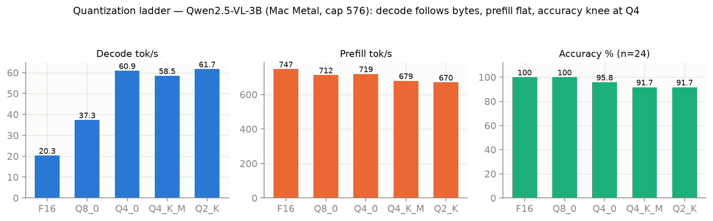
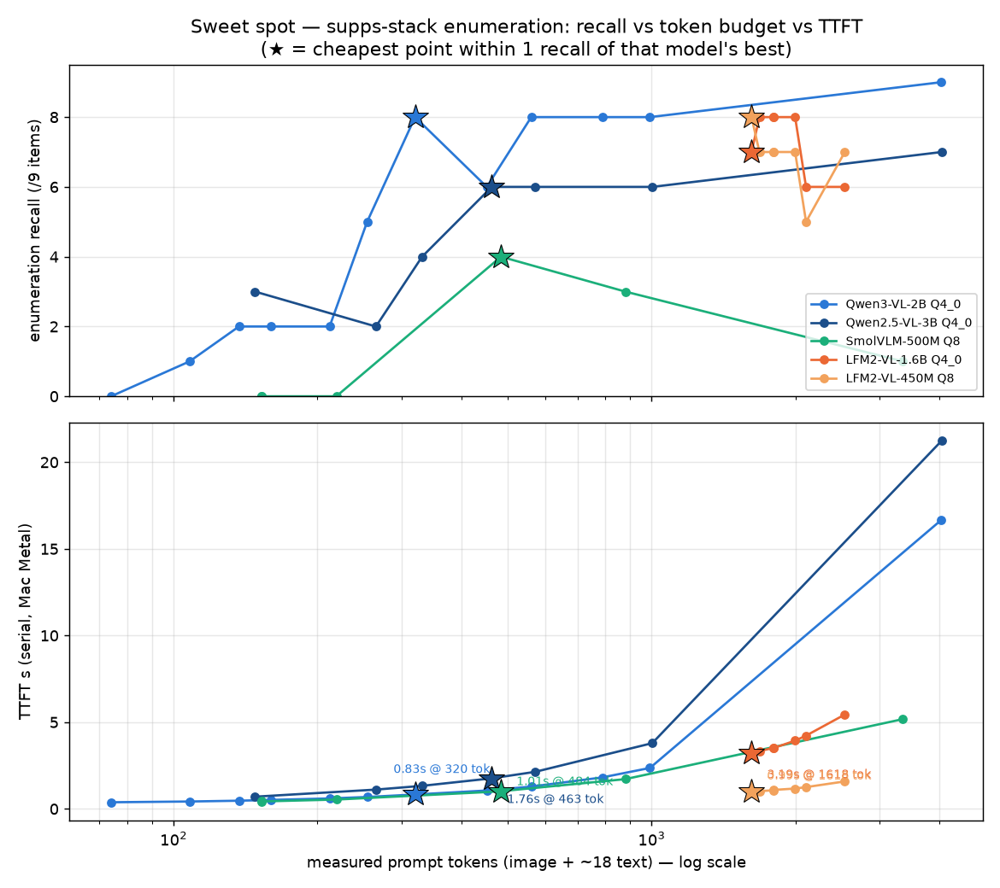
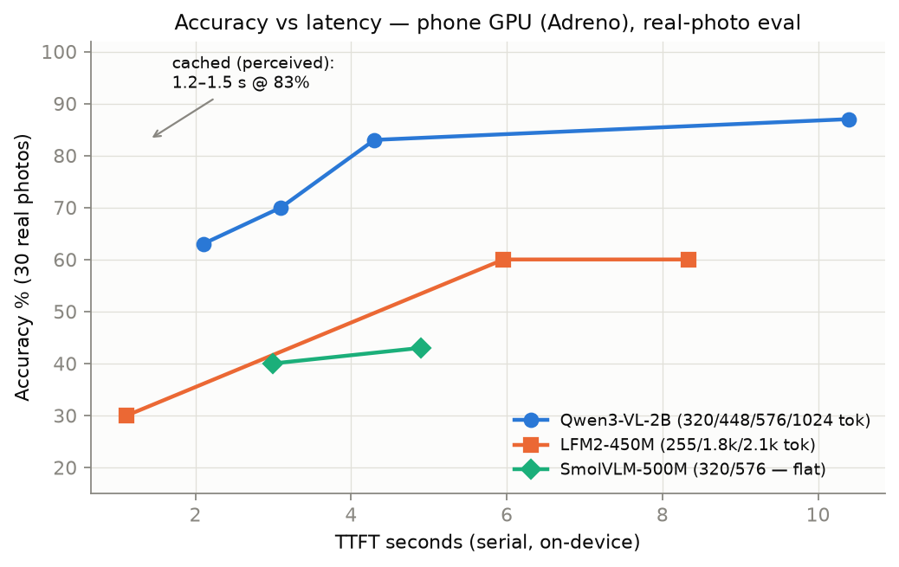
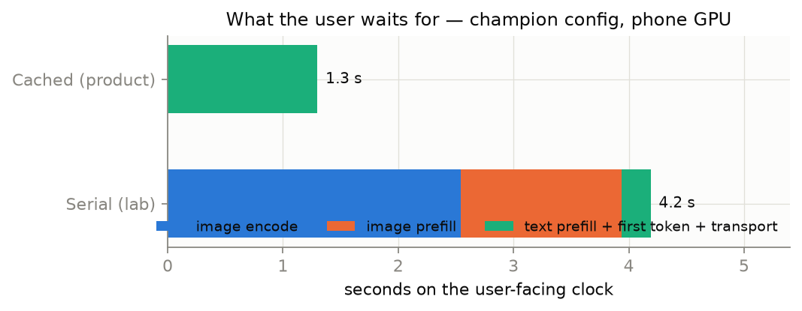

# Ordo Take-Home — A Vision Model on a Phone

**Submission report** · Anil Sahith · OnePlus 15R (Snapdragon SM8845, 12 GB) · champion: Qwen3-VL-2B Q4_0 · llama.cpp + Adreno GPU
*Living document — regenerated as pending runs land. Companion detail: [LAB_NOTES.md](LAB_NOTES.md) (every measurement) · [JOURNEY.md](JOURNEY.md) (decision log) · [QA.md](QA.md) · [BEST_RESULT.md](BEST_RESULT.md) · live dashboard (`dashboard/`) with per-run drill-down.*

**Provenance.** Every inference in this project — every model, runtime, backend, token budget, on both devices — is one row in an append-only ledger, exported chronologically to [`results/history_all_runs.csv`](../results/history_all_runs.csv) (regenerated with every render of this document). Each row carries the full history columns: timestamp, device/runtime/engine, variant, token cap, measured prompt tokens, encoder/decoder placement with its evidence, TTFT/encode/prefill/decode timings, peak RAM & SoC temperature, the exact question, the model's raw answer, the ground truth it was scored against, and the verdict. Every table in this report is an aggregation of those rows; nothing was measured off-ledger.

---

## Part 1 — Getting a vision model onto a phone ✅

**Model choice.** Started with Qwen2.5-VL-3B-Instruct (best OCR-class reader in the 0.3–4 B range, official multi-precision GGUFs, first-class llama.cpp support, dynamic-resolution ViT = a controllable image-token knob). Mid-project, measurement dethroned it: **Qwen3-VL-2B-Instruct** equals or beats it on accuracy while being ~2× faster at every stage and half the download (1.0 GB). Final bracket measured: Qwen3-2B, Qwen2.5-3B, SmolVLM-500M, SmolVLM2-2.2B, LFM2-VL-450M & 1.6B.

**How it runs.** llama.cpp cross-compiled with the Android NDK (arm64, i8mm/KleidiAI), binaries in `/data/local/tmp` over **wireless adb** — no app, no root, driven from a laptop harness + live dashboard. Three builds: Adreno-OpenCL (champion), tuned-CPU, and a **portable `armv8.2-a` compat build** that runs on any recent arm64 Android at only ~20% prefill cost.

**What had to be patched.** llama-server exposes no per-request vision-encode timing — and stage separation is the heart of this assignment — so we patched `tools/server/server-context.cpp` to log it. (MNN needed `MNN_BUILD_OPENCV=ON` or it *silently ignores images* — trap #7 below. LiteRT needed a hand-built stub library exporting three no-op symbols to satisfy an undistributed dependency.)

**Runtimes tried** (full grid in Part 3): **llama.cpp** (winner), **MNN** (own build: text engine excellent, best cold-start at 7.5 s incl. load; vision encoder 5–6× slower on both platforms), **LiteRT** (fastest model init measured, 0.8 s for 3 GB; slowest compute; vision locked inside app SDKs; macOS binaries unbuildable without full Xcode), plus documented assessments of GenieX (device-gated), MediaPipe/Gallery (per-SoC APKs carrying a QNN stack).

**GPU or NPU?** (Full per-model stage→backend map in Part 3.) **GPU: yes — both stages, proven by ablation**: encoder 7.8 s on Adreno vs 22.6 s forced-CPU (2.9×); decoder prefill ~410 vs ~55 t/s (~7×). **NPU: no accessible path on this SoC**, evidenced at every layer — no Hexagon HTP runtime libs in `/vendor/lib64`; LiteRT accepts `--backend=npu`, loads the QNN libs, then the public model bundle itself refuses ("model requires [cpu,gpu]" — NPU needs per-SoC compiled bundles; only a MediaTek one exists publicly). On Snapdragon today the NPU is vendor-privileged.

**Shipping a 1–2 GB model to users.** Not in the APK: post-install CDN download (WorkManager: resumable, checksummed, Wi-Fi-gated) or Play Asset Delivery (2 GB packs); iOS: On-Demand Resources. Quantization is a distribution feature — our champion is a 1.0 GB download vs 5.8 GB F16.

**Seven measurement traps** found and fixed en route (each silently corrupted numbers): prompt-cache faking repeat TTFTs · encode hidden inside "prefill" · sentence-vs-span ANLS scoring · verbose models truncated before their answer · constant-95 °C trip-point pseudo-sensors · a battery-charge zone masquerading as 57 °C thermal · a build flag that silently drops image input.

---

## Part 2 — The eval set ✅ (camera-shot upgrade pending)

**Construction.** Three tiers: (1) a 24-image **synthetic dev set** (rendered menus/receipts/medicine/signs/handwriting/whiteboards/spines/appliance displays with controlled rotation/blur/dim/glare/occlusion; exact auto-generated ground truth; 9/9/6 easy/medium/hard) used for pipeline mechanics; (2) the **30-photo real set** from the user's gallery — per-item provenance labels, one spoken-style question and short factual ground truth each, drafted by reviewing every image and human-verified; (3) camera-shot replacements planned (24/30 current items are WhatsApp-sourced — declared openly; the assignment's own-photos rule requires re-shooting for final submission, targeting the missing categories: menus, receipts, handwriting, medicine, appliance displays).

**Metric.** Normalized substring/alias match on a short factual answer (uniform brevity instruction — protocol v2), span-based ANLS secondary. Chosen because Ordo's task is *extracting one fact aloud*; binary fact-presence is product-faithful and human-auditable, and every prediction is stored raw so corrected ground truth re-scores offline.

**"How would you know the eval set is any good?" — we measured it.** The synthetic set scored every model 92–100%: *zero discrimination*. The real set spread the same models **47%→87%** and exposed a +30-point synthetic inflation for small models (LFM2-450M: 24/26 synthetic → 18/30 real). An eval set is good exactly insofar as it separates systems known to differ. Also applied: test-retest (temp-0 repeats), cross-platform consistency (identical answers — including identical *wrong* answers — on Metal and Adreno), difficulty-gradient sanity, per-item auditability.

---

## Part 3 — The quantization ladder ✅ (+ runtime & token axes)

**Per-precision table — Qwen2.5-VL-3B family on the 24-image *synthetic* dev set (Mac reference; the champion ladder below re-ran the precision axis on the 30 real photos):**

| Precision | Size | Accuracy (synthetic, n=24) | GPU prefill | GPU decode | Peak RAM* | Encode |
|---|---|---|---|---|---|---|
| F16 | 5.75 GiB | 24/24 | 747 t/s | 20.3 t/s | ~7 GB class | unchanged across ladder |
| Q8_0 | 3.05 GiB | 24/24 | 712 | 37.3 | ~4 GB | " |
| Q4_0 | 1.70 GiB | 23/24 | 719 | 60.9 | ~2.5 GB | " |
| Q4_K_M | 1.79 GiB | 22/24 | 679 | 58.5 | ~2.5 GB | " |
| Q2_K | 1.18 GiB | 22/24 | 670 | 61.7 | ~2 GB | " |

*Peak RAM: phone VmHWM sampling; OpenCL driver buffers under-report on GPU runs — CPU-path peak for the 2B champion measured 3.9 GB.*

**Champion ladder (Qwen3-VL-2B, our own 30 real photos, @576) — the assignment-grade ladder:** Mac Metal reference — **BF16 24/30 · Q8_0 24/30 · Q2_K 24/30**, identical accuracy across the entire precision ladder while decode runs 32 → 62 → 97 t/s: on the 2B champion the real-photo set detects *no* quantization damage even at Q2_K (the Qwen2.5-3B knee at Q4 above was on synthetic fine-print items). Phone GPU: **Q4_0 = 25/30** (TTFT p50 4.1 s, encode 2.6 s, decode 25.9 t/s); **Q8_0 = 25/30** (TTFT 6.3 s — accuracy flat, +54% TTFT from bandwidth); **@1024 = 26/30** (TTFT ~10 s). **Q2_K held accuracy but not the GPU**: no OpenCL kernels for its weight type → decoder silently on CPU, 18 t/s prefill, 37 s TTFT — ablation-confirmed (`-ngl 99` vs `-ngl 0` prefill identical), with a sharp corollary: *requesting* offload for an unsupported type is 70× destructive on decode (0.43 vs 30 t/s pure-CPU) — the 742 MB size-floor is Metal-only. BF16 probe: GPU-resident but bandwidth-bound (157 t/s prefill / 15 t/s decode, 10.5 s TTFT — feasible, pointless). MXFP4: no OpenCL kernels (Metal-only). **Final deployable Android ladder: Q4_0 (champion), Q8_0, F16/BF16 (slow) — precision never moved accuracy on this model; kernel coverage decided everything else.**

**The FP4 question.** NVFP4 proper is Blackwell-silicon-only (hardware FP4 with FP8 block scales) — no path in llama.cpp or on Adreno/Metal. Its open cousin **MXFP4** (OCP microscaling: E2M1 + shared power-of-two scales per 32) *is* in our build, with a trap: the stock `MXFP4_MOE` type is a **silent no-op on dense models** (it emitted pure Q8_0 — caught by tensor-dump, trap #8). Forced onto all weight matrices via per-tensor overrides: 1.09 GB (Q4_0-class), and measured **25/30 — the equal-best Mac ladder score — at 89.5 t/s decode** (near-Q2_K speed). Verdict, completed on-device: **Metal-only.** The phone cell caught the decoder falling to CPU at launch (25 t/s probe — no OpenCL MXFP4 kernels): supps enumeration still 7/9 @576 (equal to the champion — accuracy is backend-invariant, again) but at 22 s TTFT. A rung can be accuracy-perfect and still undeployable: kernel coverage decides.

**The laws the ladder establishes.** Decode is memory-bandwidth-bound → follows bytes (20→62 t/s). Prefill is compute-bound → flat-to-negative under quantization. Encode is untouched (separate mmproj). **Therefore quantization never bought TTFT** — it buys download size, RAM, and decode speed. Encoder quant (mmproj Q8 vs F16): zero accuracy delta anywhere; on Adreno, F16 encode is 1.9× *slower* (bandwidth). Sub-1B quant probe: LFM2-450M Q4_0 = 17/30 vs Q8's 18/30 — holds within noise at a 42% smaller file.

**Where it breaks first.** Handwriting, by *salience retreat*: Q4/Q2 answer with the big legible header ("Todo") instead of reading the handwritten lines beneath — a confidence collapse on the hardest glyph class, not gibberish. Small models fail differently (dense-text extraction failure: echoing a receipt instead of totaling it); token starvation fails differently again (*confident hallucination* — "100 tablets", "Blueberry").

**Encoder vs decoder — which degrades faster, and how we know.** The **decoder** — provable because the mmproj is a separate file, quantized independently: every failure appeared with the encoder held constant at F16, while encoder Q8 vs F16 changed nothing anywhere.

**The token axis (encode-budget ladder, phone GPU, real photos):**

| Budget | Qwen3-2B acc | TTFT p50 |
|---|---|---|
| ~320 tok | 63% | 2.1 s |
| ~448 tok | 70% | 3.1 s |
| ~576 tok | **83%** | 4.3 s |
| ~1024 tok | **87%** | ~10 s |

≈ every −128 tokens: −1 s TTFT, −7–10 pts accuracy — a smooth slope across diverse photos (per-photo it's a knife-edge: a 4% pixel difference flips digits, and *any client-side resample* loses digits the model's own smart-resize keeps — falsified three ways). Enumeration tasks flatten the curve (@320 = @576 recall), so **per-query token routing** beats any fixed cap.

**The sweet-spot experiment** (one 12MP shelf photo, "name all visible supplements", recall /9, 40 runs across five models × fine token ladder, Mac Metal):

The champion's knee is razor-sharp: 0–2/9 below 256 tokens (labels physically unresolvable), a jump to **8/9 at 320 tokens / 0.83 s**, then *flat to 1024* — between 320 and 1024 you pay 2.9× the TTFT for zero extra recall. The 9th item is read only at full native resolution (4,035 tokens, 16.7 s): **one knife-edge label costs 20× the sweet-spot latency**. A real non-monotonic dip at 448 (6/9) is the resolution knife-edge again — an awkward smart-resize grid, not noise. Three architecture facts fell out: **LFM2's token knob doesn't bind** (its tiler floors at ~1,618 tokens on this image whatever the cap — that fixed floor *is* its TTFT floor, though 450M rides it to a respectable 8/9 @ 0.99 s); SmolVLM-500M *degrades* at native resolution (4/9 → 1/9 — tiling fragments the shelf); and Qwen2.5-3B is dominated everywhere on this task (slower encoder, lower ceiling: 7/9 max at 21 s) — the champion switch re-validated on enumeration.

**Tiles vs tokens — and the sub-second head-to-head (phone, 30 real photos).** Two different levels of image chopping: a *token* is one ~56×56-px patch that becomes one vector (every model produces hundreds per image); a *tile* is a whole sub-image getting its own separate encoder pass. Qwen never tiles — one pass over the whole smart-resized image, token count set directly by the cap. LFM2/SmolVLM run one pass *per tile* (~250 tokens each), so photo geometry — not the cap — sets their cost, in quantized steps. To give LFM2 a fair fast lane we shipped an architecture-specific preprocess (dashboard auto-downscales to the 1-tile budget for LFM2 configs only), then met it at the same operating point with Qwen:

| Config (same phone, same 30 photos, serial) | tokens | encode | TTFT p50 | Accuracy |
|---|---|---|---|---|
| LFM2-450M, 1-tile (512 px input) | ~160–290 | ~0.3 s (CPU tower) | **0.67 s** | 9/30 |
| Qwen3-2B Q4_0 @96 | ~116 | 0.31 s (GPU tower) | **0.82 s** | **11/30** |
| Qwen3-2B Q4_0 @128 | ~146 | 0.39 s | 0.93 s | **12/30** |
| Qwen3-2B Q4_0 @256 (equal-token) | ~262 | 0.82 s | 1.70 s | **15/30** |
| Qwen3-2B Q4_0 @576 (reference) | ~560 | 2.6 s | 4.1 s | 25/30 |

Equal tokens do **not** mean equal TTFT — prefill cost is equal, but encode = tokens × the per-token price of *that tower on that backend* (LFM2's ~86M encoder: ~1.2 ms/token even on CPU; Qwen's larger tower: ~3.5 ms/token on the GPU). That refines the token-efficiency law to its final form: **TTFT = tokens × per-token cost(architecture, backend)** — token count alone is half the price tag. Verdict at the sub-second operating point: **Qwen wins it outright** — @96 is genuinely sub-second serial (0.82 s p50) at 11/30, and both low-token Qwen cells beat LFM2's 1-tile accuracy (11–12 vs 9 of 30) at the same ~300 ms encode. At *truly* equal tokens (@256 vs the ~250-token tile) Qwen reads 15/30 to LFM2's 9/30 — the mechanism is pixels-per-token: Qwen packs ~3,136 px into each token (56×56 patches over the full frame) while LFM2's 512-px tile carries only ~800 px/token, so at the same token budget Qwen simply sees 4× more image. Even the "fast tier" belongs to the champion — one model, two budgets (fast @96–128, reading @576 + caching at 1.2–1.5 s perceived / 25/30), no second model needed.

**Who actually runs where — stage → backend map.** "GPU run" is a claim per *stage*, not per app: ggml falls back per-operator, silently (one log line is the only witness). Measured placement for every model × runtime in the bracket:

| Model | Runtime · platform | Vision encoder | Decoder | Evidence |
|---|---|---|---|---|
| Qwen3-VL-2B / Qwen2.5-3B | llama.cpp · phone | **Adreno (OpenCL)** | **Adreno** | `--no-mmproj-offload` ablation: encode 7.8→22.6 s; prefill 410 vs 55 t/s |
| LFM2-VL-1.6B | llama.cpp · phone | **CPU — silent fallback** | Adreno | server log: *"CLIP graph uses unsupported operators (OpenCL)"*; ~11 s/tile — its SigLIP2-so400m tower uses ops the OpenCL backend lacks |
| SmolVLM-500M | llama.cpp · phone | **Adreno (OpenCL)** | Adreno (818 t/s probe) | launch-probe verdict |
| LFM2-VL-450M / SmolVLM2-2.2B | llama.cpp · phone | **CPU — silent fallback** (same op gap as the 1.6B) | Adreno (1,065 / 259 t/s) | probe-launch log; the 450M's small tower hides it (1.6–4 s encode), the 2.2B's does not (55 s) |
| Qwen3-VL-2B **MXFP4** | llama.cpp · phone | Adreno | **CPU — no OpenCL MXFP4 kernels** (25 t/s probe) | the FP4 rung is Metal-only |
| Qwen3-VL-2B **BF16** | llama.cpp · phone | Adreno | **Adreno** — GPU-resident but bandwidth-bound (157 t/s prefill, 15 t/s decode) | llama-bench + probe; scored query correct at 10.5 s TTFT |
| Qwen3-VL-2B **Q2_K** | llama.cpp · phone | Adreno (Q8 mmproj) | **CPU — ablation-confirmed** (`-ngl 0` = `-ngl 99` prefill) | no OpenCL Q2_K kernels — and offloading is *actively destructive*: 0.43 t/s decode offloaded vs 30 t/s pure-CPU (weights in GPU buffers, ops on CPU → per-step round-trips). Coverage is per weight-type: Q4_K_M measured GPU-class (213 t/s) |
| all six models | llama.cpp · Mac | **Metal** | **Metal** | zero fallback warnings across all server logs; encode scales cleanly with encoder params (0.08 → 0.19 → 0.63 → 2.3 s) |
| any | llama.cpp phone-CPU build | CPU (i8mm/KleidiAI) | CPU | build target |
| Qwen3-VL-2B | MNN · both | configured backend (OpenCL/Metal) — but kernels 5–6× slower; **omits vision entirely** if built without `MNN_BUILD_OPENCV` | same backend | timed A/Bs + rebuild-and-reverse experiment |
| Gemma (3n/4 E2B) | LiteRT · phone | locked inside app SDKs — not reachable from CLI | CPU (XNNPACK); GPU libs undistributed; NPU refused by bundle | `--backend` probes at every layer |

**The full tuning grid — every measured variant, worst → best** (phone GPU, serial, 30 real photos; ledger medians across all uncached cells — every underlying row is in the dashboard history):

*Qwen3-VL-2B (champion family):*

| Variant | tokens p50 | encode p50 | TTFT p50 | Accuracy | Note |
|---|---|---|---|---|---|
| Q4_0 @96 | 116 | 0.31 s | 0.82 s | 11/30 | sub-second serial floor |
| Q4_0 @128 | 146 | 0.39 s | 0.93 s | 12/30 | |
| Q4_0 @256 | 262 | 0.82 s | 1.70 s | 15/30 | |
| Q4_0 @320 | 326 | 1.13 s | 2.11 s | 19/30 | enumeration sweet spot |
| Q4_0 @448 | 449 | 1.80 s | 3.11 s | 21/30 | |
| Q2_K @576 | 574 | 3.69 s | **37.3 s** | 21/26 (81%) | decoder CPU-fallback, ablation-confirmed — accuracy held, latency died |
| Q8_0 @576 | 580 | 3.82 s | 6.34 s | 25/30 | accuracy = Q4_0 at +38% TTFT |
| **Q4_0 @576 ★** | 580 | 2.67 s | 4.61 s | **25/30** | champion serial |
| Q4_0 @1024 | 1008 | 9.46 s | 13.2 s | **26/30** | accuracy ceiling |
| **Q4_0 @576 + warm-on-drop** | 580 | hidden | **1.17–1.46 s perceived** | 25/30 | **the shipping config** |

(BF16 @576: GPU-resident probe, 1 scored query correct at 10.5 s — feasible, pointless. MXFP4: Metal-only, no OpenCL kernels.)

*LFM2-VL-450M Q8 (input-resolution is its only real knob):*

| Input | tokens p50 | encode p50 | TTFT p50 | Accuracy | Note |
|---|---|---|---|---|---|
| cap @1024 (upscaled tiles) | 3092 | 8.65 s | 12.4 s | 1/5 | upscaling past native grid destroys accuracy |
| 1024 px | 278 | 0.32 s | 0.62 s | 9/30 | resolution-starved |
| 512 px (1-tile) | 173 | 0.32 s | 0.66 s | 9/30 | fastest, same starvation |
| 1344 px | 796 | 0.92 s | 1.57 s | 15/30 | |
| native 12 MP | 2317 | 3.08 s | 5.98 s | **19/30** | its ceiling (Q4_0 probe: 17/30 vs Q8 18/30 on Mac) |

*SmolVLM-500M Q8 (capacity-limited — the knob barely matters):*

| Input | tokens p50 | encode p50 | TTFT p50 | Accuracy | Note |
|---|---|---|---|---|---|
| native | 691 | 4.30 s | 6.36 s | 7/16 | partial cell |
| @320 | 227 | 1.13 s | 2.19 s | 12/30 | |
| @576 | 494 | 2.51 s | 4.48 s | **13/30** | flat ~40% everywhere |
| 512 px (1-tile) | 160 | 0.56 s | 0.96 s | 9/30 | sub-second reached; accuracy flatline confirms capacity limit |

The grid read top-to-bottom is the whole story: Qwen's accuracy climbs smoothly with tokens (11→26 of 30) because its knob controls real resolution; LFM2 steps in tile quanta and starves below 1344 px; SmolVLM is flat at ~40% at every setting — more pixels can't fix capacity. And the two worst rows are both *backend* failures, not model failures (Q2_K's CPU decoder, LFM2's upscaled tiles). The sub-second club, final standing — all three architectures measured at their fastest full-pipeline point on the same 30 photos: **LFM2-450 1-tile 0.67 s / 9-of-30 · SmolVLM-500 1-tile 0.96 s / 9-of-30 · Qwen3-2B @96 0.82 s / 11-of-30 and @128 0.93 s / 12-of-30** — the champion wins even the speed class the small models were built for.

**Why the same file lands differently per platform.** Every stage is a ggml compute graph, and at load time each backend is asked, operator by operator, "do you have a kernel for this?" Metal is ggml's most mature GPU backend with near-complete op coverage — LFM2's SigLIP2 encoder runs fully on the M-series GPU. The OpenCL/Adreno backend is the youngest with a narrower op set — the same SigLIP2 graph contains operators it doesn't implement, so llama.cpp reroutes the whole CLIP graph to CPU. **"GPU-capable" is not a property of the model; it's per-backend, per-operator kernel coverage.** The tally makes it vivid: on the *same phone GPU*, Qwen's and SmolVLM-500M's encoders run fine while both LFM2s and SmolVLM2-2.2B fall off; the same lottery hit the decoder via weight types — Q2_K and MXFP4 (CPU on Adreno, GPU on Metal) vs Q4_0/Q8_0/BF16/Q4_K_M (GPU on both). Product consequence: on Android, LFM2-450M's TTFT floor is CPU-encoder-bound at ~1.6 s *per tile* — its 0.99 s Mac numbers reproduce on the phone only for 1-tile photos (measured: 0.44–1.0 s single-tile vs ~8 s three-tile on the same 5-photo cell, flat across every token cap because the cap can't change tile count). So the mobile-model question isn't "how good is the model" but **"does every stage of this architecture have kernels on this backend"** — and it has to be measured, because nothing announces the fallback.

Within a model, `-ngl 99` *requests* all decoder layers on the GPU — whether they land there depends on that same kernel coverage, and the backend won't tell you when they don't (the Q2_K fallback produced zero log output; only the CLIP-graph case warns). So the dashboard now **measures** placement at every server launch: the encoder via the log scan, the decoder via a text-only ~250-token probe prefill (GPU class 250–420 t/s vs CPU 17–55 on this device — an order of magnitude apart, no ambiguity), stamping every history row `enc/dec` with the measured rate. Silent fallback — either stage — can't recur unlabeled.

**Cross-runtime grid (same photo, same question, serial, warm):** llama.cpp wins vision encode 5–6× on both platforms and is the only runtime reading fine print. Phone: llama.cpp-Adreno enc 2.6 s / TTFT 4.1 s ✓ · MNN-OpenCL enc 14.4 s / 17.3 s ✗ · LiteRT text-only (init 0.8 s, prefill 23 t/s, decode 7.3 t/s). Mac: llama.cpp-Metal 1.27 s TTFT ✓ · MNN-Metal ~4.2 s ✗. Enumeration recall (name 9 products): Qwen3 8/9 · LFM2-450M 5–7/9 · Smol-500M 4/9 · MNN 2/9. FA/quantized-KV audit, both platforms: flash attention already active by default (Metal +5%; **Adreno measured: prefill +6%, decode +10%** — though some graphs opt out per-model: the LFM2 server warns FA-unsupported); quantized q4_0 KV *costs* decode (−8% Metal, **−20% Adreno**) and is invalid without FA (context creation fails, reproduced on both) — worth it only if context RAM binds. Net: the defaults were already optimal; no optimization left on the table.

**The architecture result — what the user actually feels:**

The camera sees the scene before the user finishes speaking → encode + image-prefill run during speech (`cache_prompt`), leaving only text-prefill + first token on the clock. Measured on-device: serial 8.8 s → **cached 1.17–1.46 s at full accuracy** (0.25–0.44 s for big-text queries; follow-ups ~1.2 s). Shipped in the dashboard as warm-on-drop. No accessible runtime/silicon reaches sub-second *serial* TTFT at reading accuracy on this device — sub-second is achieved architecturally.

---

## Part 4 — Under stress ✅ (complete)

Champion config, unplugged, screen on, **no cooling** (deliberately):

| Test | Result |
|---|---|
| **Sustained load** (59 consecutive queries — 3× the asked 20) | decode 23 → 14–15 t/s by query 10, then **flat through query 59**; TTFT equilibrium ~6.8 s (+65% vs cool). A plateau, not a spiral |
| **Thermals @ 10 min** | SoC equilibrium 56–68 °C (peak 78) — soft landing, no hard throttle; **59/59 answers correct: accuracy is thermally invariant** |
| **Memory pressure** (YouTube, Chrome, Instagram, Maps launched mid-run) | **zero measurable impact** — OpenCL-pinned buffers are eviction-immune (converse: the CPU path *is* vulnerable — page-cache eviction produced 0.4 t/s decode) |
| **Battery** | 3% across 64 queries ≈ **0.05%/query** |

Worst case also characterized: a 95.8 °C phone delivers 0.4 t/s decode and a 685 s TTFT — thermal state is a 10–40× lever, hence the cool-gated protocol behind every lab number.

---

## Part 5 — LoRA fine-tune ⏳ (prepped; run pending)

QLoRA on the 4-bit champion, **decoder-side adapters** (Part 3 proved the decoder degrades first), trained on eval-style extraction pairs with **images pre-capped at the deployment budget** — designed to test recovery of both the quantization delta and the token-budget losses ("teach it to squint"). Ready: 192 disjoint synthetic training images (`eval/train_synth/`), Colab notebook (`notebooks/qlora_qwen3vl_colab.py`), GGUF-adapter export path (`--lora` on-device). Results section fills in after the Colab run + on-device re-eval.

---

## Recommendation (what we'd ship)

**Qwen3-VL-2B Q4_0 + Q8 encoder + llama.cpp/Adreno + per-query token routing (320 scene / 576 fine-print) + warm-on-capture caching.** User experience: first word 1.2–1.5 s after the question ends at 83–87% real-photo accuracy; ~2 s full spoken answer; follow-ups ~1.2 s — inside a conversational budget *with* ASR/TTS, because vision work overlaps the user's own speech. Device tiers: Adreno-OpenCL where present; portable CPU build (+MNN-CPU decode rescue) elsewhere — same caching architecture everywhere, graceful degradation of the hidden phase only. If Ordo controls its hardware BOM: pick a SoC with an accessible NPU stack — that one decision outweighs every software optimization in this report.

## What surprised us (short list; full narrative in JOURNEY.md)

1. Same GPU, same image: **2.6 s or 122 s of encoding depending on whose kernels** (llama.cpp vs MNN-vision) — runtime×silicon dominates model choice.
2. **Quantization never bought TTFT** — 6× smaller download, 3× decode, same wait.
3. **TTFT is a property of token count, not kernel speed** — LFM2's 3× faster encoder is fully repaid by 3.8× more tokens (dead-heat TTFT, worse accuracy).
4. **A 4% pixel difference flips digits**, and no client-side resampler survived it.
5. **The phone lies**: fake thermal sensors (×2 kinds), invisible clock governors, page-cache eviction dressed as slow inference — seven traps total.
6. **Synthetic evals inflate small models by +30 points** — the cheapest proof of the assignment's own-photos rule.
7. Sustained load **plateaus** instead of spiraling; accuracy doesn't flinch at 78 °C.
8. The champion **switched mid-project** when Qwen3-VL-2B beat the original pick on every axis — keeping the bracket open paid.
9. **Kernel coverage, not precision, decides deployability** — Q2_K and MXFP4 are accuracy-equal to Q4_0 but decode on CPU on Adreno (no OpenCL kernels for those weight types), while the same files fly on Metal. Three of six model-encoders silently fell off the phone GPU the same way. We now *measure* placement at every launch instead of trusting flags.
10. **Our own tuned-CPU build carried a 67× decode defect** — bench-isolated: 31 t/s prefill but **0.45 t/s decode**, while the OpenCL binary at `-ngl 0` decodes 30 t/s on the same silicon (suspect: KleidiAI repack path / `-march=armv8.7` flags; open). Caught only because every run lands in the ledger with placement labels and rates. Fix shipped: the CPU engine now runs the ocl build at `-ngl 0` — honest CPU physics. The moral doubles trap #10: *a healthy-looking build can be broken in one stage only.*

## What we cut, and why (full list in README §8)

NPU integration (gated at every layer — evidence documented to the missing-library level) · MNN-CPU vision (froze the device twice) · LiteRT-on-Mac (unbuildable without full Xcode; four binary generations tried) · llama.cpp phone-CPU decode pathology root-cause (GPU made it moot; documented open) · speculative decoding (decode-only gain, multi-day cost) · LoRA deferred by prioritization, not cut.

---

## Final verdict

**Sub-second on-device vision inference is achievable today** — measured, serial, no cache, no NPU, on a stock Android phone over llama.cpp + Adreno GPU, on our own 30 real photos. Three architectures crossed the line: **Qwen3-VL-2B @96 = 0.82 s (11/30) and @128 = 0.93 s (12/30) · LFM2-450M 1-tile = 0.67 s (9/30) · SmolVLM-500M 1-tile = 0.96 s (9/30)**. The same physics holds CPU-only (no GPU at all): Qwen @128 scored 13/30 — accuracy is backend-invariant; only the clock changes. (The CPU-only latency column had its own detective story: the tuned-CPU build binary turned out to carry a decode-only 67× defect — 31 t/s prefill / 0.45 t/s decode, bench-isolated — while the OpenCL binary at `-ngl 0` decodes ~30 t/s on identical silicon. The CPU engine now uses the healthy path; CPU-floor cells re-measured on it.)

**Even <500 ms was touched, twice, by different routes.** Serial: LFM2-450M at cap 64 on a small 1-tile photo — **0.44 s TTFT, 157 ms encode (on its CPU-fallback encoder, no GPU vision at all), 84 tokens** — with the expected cost: the knife-edge digits degraded at that budget (ledger row, single sighting). Perceived: the champion's cached big-text tier — **0.25–0.44 s** with warm-on-drop + right-sized capture. So the sub-half-second class exists on today's hardware in two forms: tiny inputs (pay in accuracy) or caching (pay in query-class coverage) — the trainable-accuracy path below is what turns the first form from a stunt into a tier.

**One model holds the entire frontier.** The champion spans it with a single dial: 0.82 s @ 37% → 1.7 s @ 50% → 2.1 s @ 63% → 4.6 s @ 83% serial → **1.17–1.46 s perceived @ 83% with two-phase caching** → 13 s @ 87% ceiling. No small model earns a place at any point on that curve — the champion wins even the speed class they were built for.

**The laws behind the curve** (each measured, several the hard way): TTFT = tokens × per-token cost of the architecture on the backend · accuracy at a budget tracks pixels-per-token · kernel coverage, not precision, decides what's deployable · precision is a distribution lever (download size, decode speed), never an accuracy or TTFT lever on this model · caching is the only measured path to sub-second *with* the fine print.

**The path forward — accuracy at fixed latency, not latency itself.** Fine-tuning cannot speed up TTFT (that's set by tokens × silicon), but it attacks exactly what limits the fast tier: the resolution-starved misses at low token budgets. **SFT/QLoRA trained at the deployment budget** (same smart-resize, @96–320 inputs) teaches the model to read what those budgets actually show it — the Colab pipeline is prepped (Part 5) with train-at-deployment-budget as its core experiment. DPO/RL then shape answer format (brevity, fact-first), trimming decode tokens and stabilizing scoring while leaving TTFT untouched. Target end-state: the 0.8–0.9 s tier moving from ~37–40% toward the 60%+ band — sub-second latency already proven, accuracy the trainable half.
